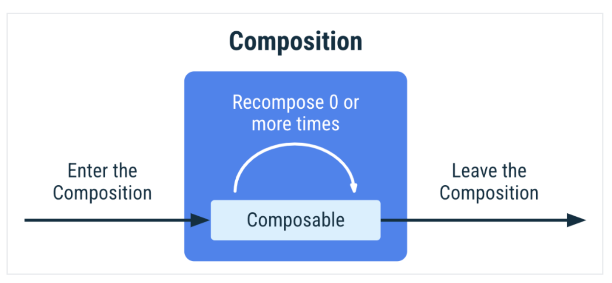

 

사내 Admin 에 Compose 를 도입했다. 이전에 사이드 프로젝트에서 적용 해 본 경험이 있는지라 Compose 로 UI 를 구성하고, 상태와 데이터를 관리 하는 것은 시간은 걸리되 생각보다 그리 어렵지 않았다. 오히려 Compose 의 편의성을 몸소 체감하며 개발을 하는 중이다.

그러나 예상과 다르게 자잘한 이슈들은 compose 의 핵심인 recomposition 의 동작과정을 이해하지 못하는 데서 왔다.
compose 의 생명주기는 매우 심플하다. 처음에는 이 간단한 lifecycle 이 개발을 더 단순하고 편리하게 해 줄 것이라고 기대했지만, 개발을 하면 할수록 fragment 와 activity 의 라이프사이클에 익숙한 나는 생명주기에 맞춰 이벤트를 처리하는 방법과 리엑티브 패러다임의 선언적 UI의 데이터 업데이트 방식에 혼란이 찾아왔다.

compose 에 대해 가볍게 훑어보고, compose 의 동작원리와 생명주기를 파악해 보려고 한다.
이후 프로젝트를 진행하며 마주했던 이슈들을 토대로 하여 Compose 로 개발 할 때 고려하면 좋은 점을 정리 해 보았다.

## | overview

1. compose 란?
    1. compose 의 특징
    2. 선언형 패러다임 
2. compose 의 라이프사이클
3. lifecycle 관련 이슈
    1. Compose 프로젝트의 구조
    2. 컴포저블의 잦은 재호출
    3. 생명주기에 따른 이벤트 처리

## Compose 란?
Android 에서 UI 개발을 위해 제공하는 툴킷이다.
반응형 프로그래밍 모델을 기반하여 동작하며, 이에 코틀린의 간결성과 손쉬움을 결합했다. 

### Compose 의 특징
이외에도 Compose 에는 다음과 같은 특징이 있다.
<ol>
<li class="li-title"><b>선언형</b></li>

우리는 이전 xml을 활용한 UI 개발에서 뷰의 계층을 줄이기 위해 Constraintlayout 의 사용을 권장했다. 그러나 선언형 프로그래밍 패러다임은 다르다. 처음부터 모든 구조를 생성한 후, 변경사항이 있는 경우에만 뷰가 업데이트 된다. 이를 `recomposition` 이라고 하는데, 이는 나중에 다뤄보도록 하자. 

<li class="li-title"><b>보일러 플레이팅 코드의 감소</b></li>
Activity, Fragment 와 XML 를 하나의 View 에서 관리가 가능해진다. 따라서 xml 을 Activity, Fragment 에 infrate 하는 과정이 사라진다. 

또한 MVVM 아키텍처일 경우 VM 에서 상태를 쉽게 전달 받을 수 있다. 데이터를 binding 한 후, observe 하고 update 하는 코드가 필요 없어진다.

<li class="li-title"><b>재사용 가능한 UI</b></li>
 

<li class="li-title"><b>동적인 UI 구성</b></li>
xml 이 아닌 kotlin 으로 동작하기 때문에, if 문을 사용한 특정 UI 노출여부, 반복문, 리스트 등과 같은 동적 UI를 구성하는 것이 가능해진다. 
</ol>

### 선언형 프로그래밍 과 명령형 프로그래밍
위에서 명령형/선언형 프로그래밍에 대한 개념이 등장하는데, 이해를 돕기 위해 내용을 조금 더 추가해 보겠다. 

<li class="li-title"><b>명령형</b></li>
각 위젯은 자체의 내부 상태를 유지하고 getter, setter 메소드를 노출한다.
 
 

<li class="li-title"><b>선언형</b></li>
각 위젯은 stateless 상태이며 getter, setter 메소드를 노출하지 않는다. composable 함수를 인수로 호출하며 UI 를 업데이트 한다.

상태가 변경되면 composable 은 새 데이터와 함께 다시 호출한다. 이 과정을 recomposition(재구성) 이라고 한다. 

쉽게 설명해 보자면, 
명령형 프로그래밍 패러다임에서는 뷰의 state 에 접근해 값을 변경하며 UI를 업데이트 한다. 반면 선언형 프로그래밍 패러다임에서는 Recomposition 을 통해 UI 를 업데이트 한다. 
여기서 리컴포지션이라는 개념이 재등장하게 되는데, 이제 Compose 의 생명주기를 공부하며 함께 알아보자.

## Compose 의 lifecycle
글의 초입에서도 말했듯, Compose 의 lifecycle 은 아주 심플하다.

단, 용어가 헷갈릴 수 있기 때문에 한번 정리 해 보자면
* 컴포지션 : 
* 컴포저블 : 
* 리컴포즈 : 

* Recomposition
    - 값에 종속되지 않은 다른 함수는 recompositon 되지 않는다.
    - 값에 종속되는 함수와 람다만 재생성한다.
    - 비용이 많이 드는 작업을 구성 외부의 다른 스레드로 이동하고 mutableStateOf 또는 LiveData를 사용하여 Compose에 데이터를 전달할 수 있습니다

## lifecycle 관련 이슈
### Compose 프로젝트 구조
해당 프로젝트는 Single Activity 위에 Screen 을 띄우는 방식으로 동작한다. 

### Composable 의 잦은 재호출
하단 navigation tab 이 존재한다. 하지만 디테일 페이지나 로그인 페이지, AR 페이지 등 특정 페이지에서는 하단 바텀시트가 보여지지 않아야 한다. 

### 생명주기에 따른 이벤트 처리

