# 00. ISSUE

입사하고 마이그레이션 할 틈도 없이 개발환경을 셋팅하게 되어, 회사계정이 기본 계정이 되었다. 후에 개인작업을 해야 하는 상황에서 개인 private 레포지토리에 접근이 불가능하고 push가 되지 않는 이슈를 마주하게 되었다. 

> **fatal: Authentication failed for 'https://gitgub.com/레포지토리 '**
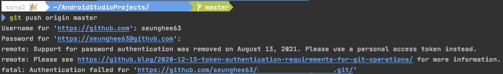

> **Error: Permission denied (publickey)** </br>
> **fatal: Could not read from remote repository**


</br>

# 01. 원인

> [In July 2020](https://github.blog/2020-07-30-token-authentication-requirements-for-api-and-git-operations/), we announced our intent to require the use of token-based authentication (for example, a personal access, OAuth, or GitHub App installation token) for all authenticated Git operations. Beginning August 13, 2021, we will no longer accept account passwords when authenticating Git operations on GitHub.com.
> 

이전에는 아이디와 비밀번호만 있으면 권한을 받고 접근할 수 있었는데, 이제는 토큰 기반 인증만을 허용하는 방식으로 변경되었다.

이때는 계정 마다 SSH key를 만등 후 등록해서 사용하면 된다.
SSH key는 공개키와 비공개키로 구성되어 있어 키를 생성하면 공개키와 비공개키가 만들어지게 된다. 생성된 비공개키는 로컬 머신(클라이언트)에 위치해야 하며, 공개키는 리모트 머신(깃 혹은 빗버킷)에 위치해야 한다. 본 게시글은 SSH Key를 생성 후 각각의 키를 적절한 위치에 위치시키고 SSH를 통해 접속하는 과정을 정리했다.

회사계정이 비트버킷이라 본 게시글은 깃허브와 비트버킷 계정을 동시에 사용하는 방법을 서술했는데, 사실상 깃허브 계정 2개를 동시에 사용하는 것과 방법이 같다. 오히려 git과 bitbucket의 차이를 비교하며 보다보면 조금 더 디테일 하게 학습이 가능할 것이다.

</br>

# 02. 실습

## 00) 연결된 계정 확인
해당 데스크탑에 연결된 계정을 확인 한다.
```
git config --list
```

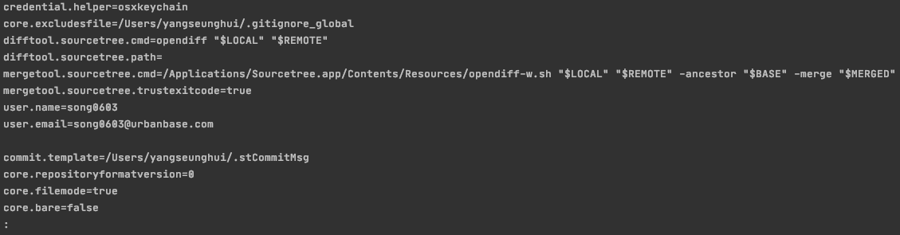

## 01) ssh 키 생성
```
ssh-keygen -t rsa -C "개인/회사 계정"
```
ssh-keygen 라는 프로그램을 활용하여 개인계정과 회사계정의 ssh 키를 각각 생성 한다. 해당 명령어를 입력하고 나면 ssh key를 생성하는 과정에서 두번 입력모드로 전환이 되는데, 그 때 입력해야하는 것은 다음과 같다.


### 01-1) seunghee63(개인계정) 키 생성
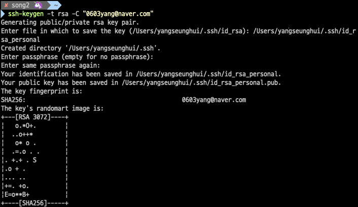
  1. **/Users/yangseunghui/.ssh/id_rsa_personal** .ssh 폴더 하단에 파일이름을 입력한다. 필자의 개인 계정 키는 id_rsa_personal 이다.</br>
  2. 키쌍 생성 중에 암호 입력을 요청하는 단계가 있는데, 이때 암호를 입력하지 말고 넘겨야 한다. 암호를 입력하면 Git/Bitbucket 서버와는 키로 인증함에도 불구하고 ssh-key를 사용할 때 암호를 입력해야 하는 번거로움이 생긴다.

### 01-2) song2(회사계정) 키 생성
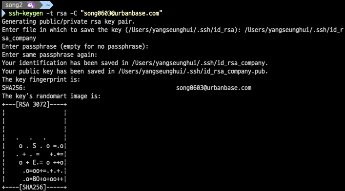
  1. **/Users/yangseunghui/.ssh/id_rsa_company**</br>
  2. 마찬가지로 암호는 입력하지 않고 넘긴다.

### 01-3) 확인
 명령어 실행하여 .ssh 폴더 안에 잘 생성되어있는지 확인한다.
.pub 확장자의 공개키와 확장자가 명시되어 있지 않은 비공개키가 한쌍씩 생성되면 성공 한 것이다.
```
ls ~/.ssh
```
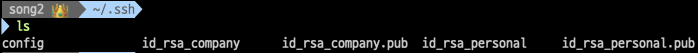


## 02) ssh-agent 에 키 등록
매번 SSH 키 패스워드 입력을 하는것은 번거롭다. 이때 백그라운드에서 SSH 인증 정보를 관리하는 ssh-agent에 키를 등록해두면 좀 더 편리하게 사용할 수 있다. ssh-agent가 실행중인지 확인한 후 키를 ssh-agent 에 등록해야 한다.

### 02-1) ssh-agent 에 등록된 ssh 키 확인
등록된 ssh 키를 확인 해 보자.
**'The agent has no identities'** 라는 문구가 나오면 ssh-agent에 등록된 키가 없다는 것이다.
```
ssh-add -l
```
</br>

### 02-2) ssh-agent 키 등록
등록된 키가 없다면 `ssh-add` 명령어를 이용해 개인계정과 회사계정의 비공개 키를 추가한다. 옵션으로 -t를 주고 시간을 설정하면 유효기간을 설정할 수 있다.
```
ssh-add "개인/ 회사 비밀키"
```
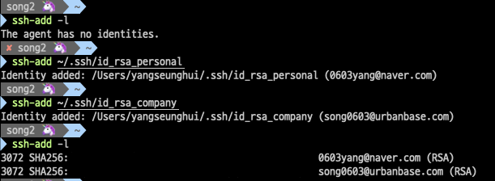</br>


### 02-3) 확인
`ssh-add -l` 명령어를 통해서는 등록되어있는 Key 의 목록을,
`eval "$(ssh-agent -s)"` 명령어를 통해서는 동작중인 프로세스를 확인 할 수 있다.</br></br>
</br>

## 03) SSH 접속 설정
`vi .ssh/config` 를 입력하여 config 파일을 실행시켜보자. 해당 파일에서는 두개의 계정 정보를 입력하면 된다.
```
Host ${임의의 닉네임} // 후에 ssh 를 통해 레포지토리를 내려받는 경우 등에 사용 된다.
HostName ${해당 계정의 도메인} // bitbucket or git 등이 올 수 있다.
User ${계정 user.name}
IdentityFile ${비밀키 경로}
```
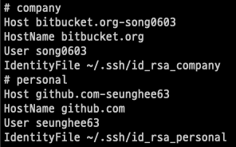


## 04) github & Bitbucket 에 ssh 키 등록하기
`cat 공개키` 명령어를 실행하면 키 값이 출력된다.
해당 내용을 복사 한 후, 개인 계정의 키 값은 회사 계정의 SSH key 등록을, 회사 계정의 키 값은 개인 계정의 SSH key에 등록하면 된다.</br></br>


**개인계정(github)**
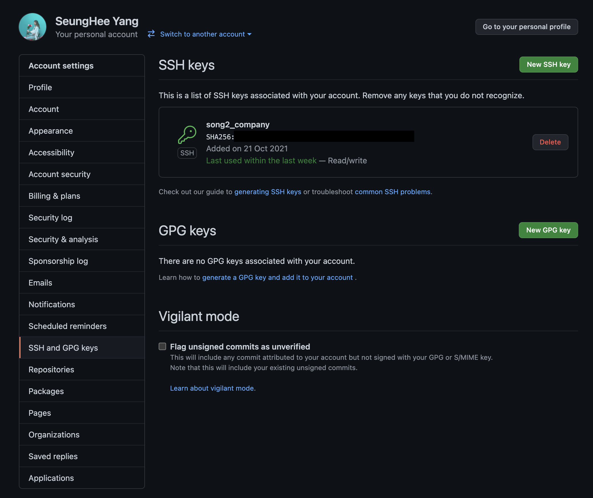

**회사계정(bitbucket)**
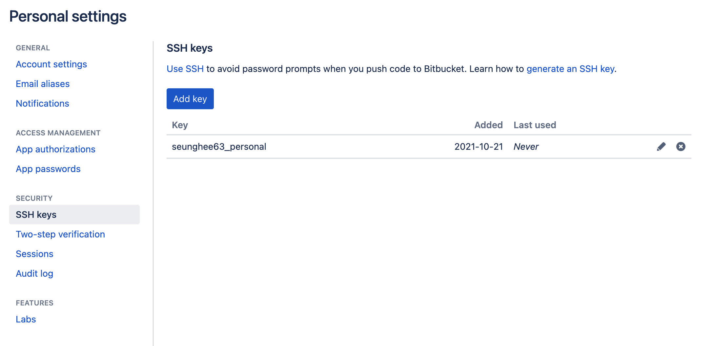


`ssh -T [HostName]` 명령어를 통해 ssh 키 등록 여부를 확인 할 수 있다.
필자의 경우 github와 bitbucket 모든 도메인을 사용했기에 두 개를 모두 테스트 해 보았다.</br></br>
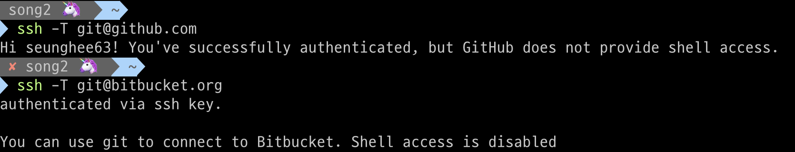


## 05) gitConfig 수정
여기까지 수행하고 나면 작업한 내용을 올리거나, 내려받는 동작이 잘 수행된다. 그러나 작업 후 커밋 기록을 보니 원하지 회사계정이 개인계정에 작업물을 올리고 있는 이슈를 마주하게 된다.</br></br>
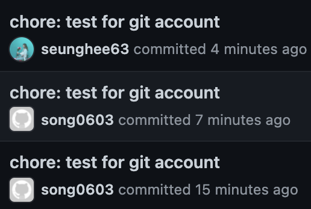

여러 SSH key를 쓰는 경우 GitHub이 어떤 계정으로 push를 하는지 구분할 수 없기 때문에 계정 전환이 필요하다. 그때 그때 config 의 user.name 과 user.email 을 수정하는 방법도 있지만, `.gitconfig`에서 약간의 문법을 수정하면 한번의 설정으로 적절한 계정전환이 가능하다.

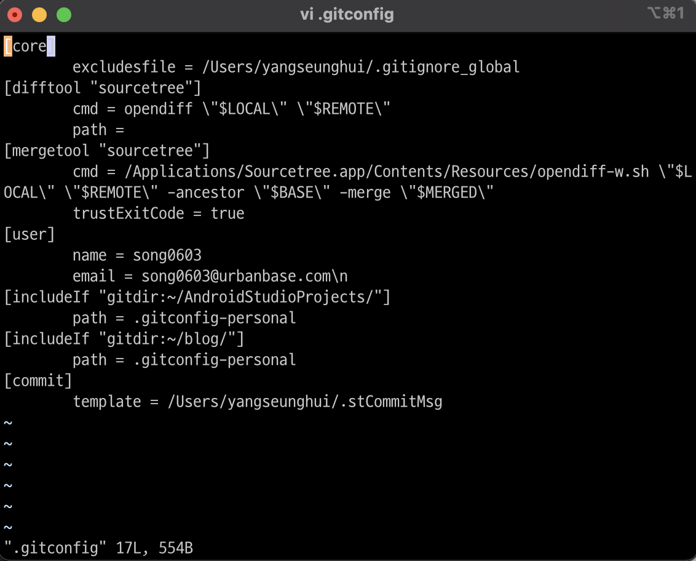</br>
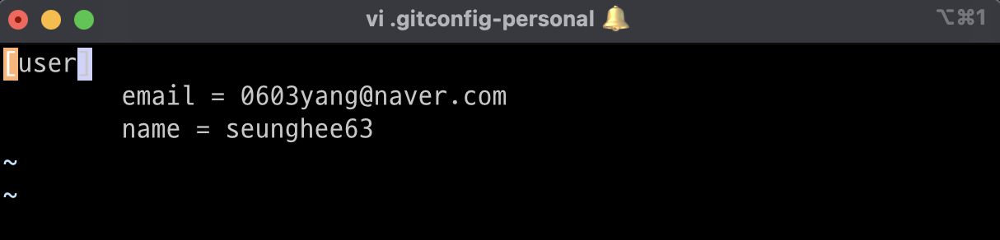</br>
주의해야 하는 부분은 두개의 `[includeif ~~]` 구문이다. 필자는 개인 프로젝트가 AndroidStudioProjects 와 blog 디렉토리에 담겨있는데, 해당 디렉토리에서 git 명령어를 실행 할 경우에는 회사계정이 유저로 등록된 gitconfig 파일이 아니라 개인계정이 유저로 등록된 gitconfig-personal 파일이 실행되도록 했다.

해당 과정을 수행하고 나면, `git clone git@${hostname}:${user.name}/${repository_name}.git` 와 같이 권한을 가지고 프로젝트를 clone 받을 필요가 없어진다.

</br>

# 03. 결과

`git config --list` 명령어를 통해 데스크탑에 연결된 계정들과 각각의 계정이 실행되는 조건을 확인 할 수 있다.
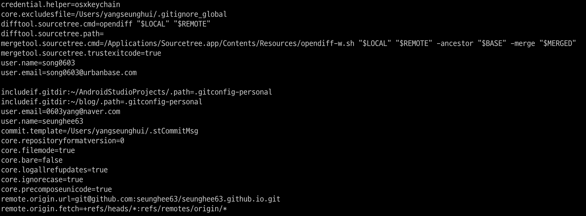</br>

---
### 덧붙임
이미 ssh 키도 생성후 등록까지 다 해서 제대로 동작하는 것을 확인했는데, 시간이 지난 후 똑같은 이슈가 발생할 수 있다. 그때는 `02) ssh-agent` 의 키 ssh-agent에 키를 등록하는 과정을 반복하면 된다.

> ref
>

[https://yosuniiiii.com/github-계정-여러개-사용하기-on-mac-6588237f9671](https://yosuniiiii.com/github-%EA%B3%84%EC%A0%95-%EC%97%AC%EB%9F%AC%EA%B0%9C-%EC%82%AC%EC%9A%A9%ED%95%98%EA%B8%B0-on-mac-6588237f9671)
