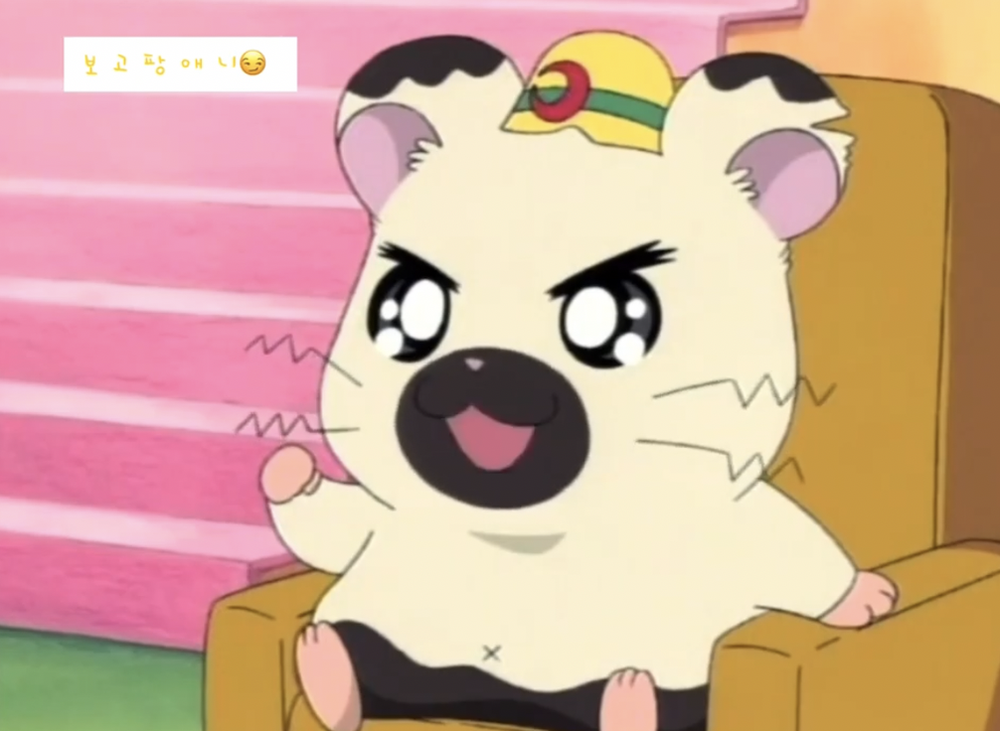

 

 
상반기엔 취업을 위해 달렸고, 하반기엔 취업 후 여러 고민들.. 은 사실 최근에 생겼고 열심히 놀았다. 
최선을 다하지 않은 데서 오는, 아쉬움이 많은 해였다. 2022는 아쉬움이 남지 않는 해가 될 수 있도록, 회고를 작성하며 올해 걸어온 길을 되돌아보려고 한다.

## 취업준비
---

### 스터디
2020년에 몇몇 기업의 면접을 보며 느꼈던 점은, 더 이상 새로운 프로젝트를 진행하기보다는 이제까지 배운 것을 정리하고 근간이 되는 기초 지식을 메워야 한다는 것이었다. 학부생 시절 이론수업과는 거리가 멀었던 나는, CS를 혼자 공부할 자신이 없었다. 함께할 때 시너지가 나는 타입이기도 했기에, 취준하는 친구들을 냅다 붙잡고 스터디를 진행했다.

OS, 네트워크부터 자료구조, 알고리즘까지 꽤 많은 스터디를 열고 참여했다. 그래도 스터디에 발담고 있으니 전반적인 흐름 파악은 잘 되었다. 지식이 내 머릿속에 완벽하게 안착한 것은 아니지만, 한번 훑어보니 면접준비를 할때나 가끔 모르는 것이 있을때 정리된 노션을 훑어보면 충분히 리마인드가 되었다. 

일주일 내내 여러개의 스터디를 준비하고 진행하니 감당하기 힘들다고 느낄 때도 가끔 있었다. 그래도 무언가를 계속하고 있었기에 마음은 가장 편한 시기였던 것 같다.

### 실전
**# 서류** 
학부생 시절 바쁘게 살아왔던 덕분에 대외활동, 프로젝트, 수상실적 그리고 자격증까지 (IT기업을 지원하기에는) 충분히 이것저것 갖춰져 있었다. 그 내용을 바탕으로 포트폴리오를 만들었고, 여러 사람에게 피드백 받아 가며 완성했기에 서류는 자신 있었다. 그러나 웬만한 기업이 서류+코테로 전형이 진행되어 내 서류는 크게 힘을 발휘하지 못했다. 그나마 다행인 점은 서류전형이 독립적으로 진행되는 기업은 대부분 합격했다는 것이다.

간간히 서류부터 떨어질 때도 있었다. 이정도면 붙겠지- 라고 속단해 자소서에 정성을 담지 않았던 게 원인인 것 같다. 마감 시간에 쫓겨 급하게 써 내었다. 여러 사람들에게 피드백을 받았으면 좋았을텐데, 글을 다듬고 보완해가는 그 과정이 없었던것이 아쉽다. 나를 어필하는 능력이 아직 많이 부족한 것 같다. 내년에도 이런 과정을 겪게 된다면 빠르게 작성하고 오픈해서 피드백을 받아보려고 한다. 용기를 내야 할 것 같다. ✊🏻

**# 코테/과제** 
코테는 붙은 게 손에 꼽아 언급하기조차 민망하다.. ㅎ 다짐 정도만 써보자면 IDE 을 쓰지 않고 코테를 푸는 환경에 익숙해져야겠다는 것이다. 알고리즘에 손을 뗀 지 반년밖에 되지 않았는데, 기억이 안 난다. 막상 문제 풀기 시작하면 다시 생각날 것 같기도 하고. 틈틈히 공부해야겠다고 마음은 먹지만 가장 실천하기 힘든게 알고리즘 같다.

과제는 아쉬운 점이 많다. 올해 네 개번의 과제전형을 치뤘는데, 개인적으로 하나같이 만족스럽지 못하다. 솔직히 말하면 실력도 실력이지만, 준비성과 열정이 부족했던 것 같다.
과제를 두세 개 정도 치러보니 어떤 유형이 나오는지 파악이 됐다. 과제가 간단한 만큼 완성도와 디테일한 포인트를 충족시키는 것이 중요한데, 그런 것들을 많이 놓쳤다. 취업 이후에 개인 공부를 한다는 명목으로 미완성했던 기능을 틈틈이 추가 개발했는데, 조금만 더 일찍 했으면 참 좋았을 텐데.. 하는 생각을 많이 했다. 시간 투자를 많이 못한 것도 아쉽다.

**# 면접** 
이전까지는 규모가 어느 정도 있는 회사만 지원했던 터라 면접 경험이 매우 드물었다. 그러다 문득 면접 경험을 쌓아야겠다는 생각이 들어 원티드로 스타트업들에 원서를 넣었다. 그렇게 한 달 동안 열번 이상의 면접을 보았다. 그렇지 않은 회사들도 있었지만, 회사들이 물어보는 기술/인성 질문은 크게 형식을 벗어나지 않았다. 대부분의 기술 질문들에 어렵지 않게 답할 수 있었다. 후반으로 접어들수록 제법 면접도 편해지고 쌓인 데이터들과 주변 사람들의 피드백을 토대로 더 나은 대답을 할 수 있게 되었다.

하지만 마냥 모든 면접이 쉬웠던 것은 아니다. 면접에서 새로 알게 된 키워드도 여럿 있었고, 내가 평상시 공부를 하거나 개발을 할 때 간과하고 지나갔던 부분들이 많다는 것을 면접을 보며 깨달았다. 모든 면접이 끝나자마자 면접 내용들을 복기하며 기록했고, 또 하나의 자산이 되었다. 면접 그 자체가 참 소중한 경험이고 컴팩트한 시간에 많은 것을 얻어 갈 수 있는 시간인 것 같다.

## 취업 그 이후
---

**# 첫회사** 
앞서 말한 중요한 면접은 떨어졌고, 몇 개의 스타트업에 합격했다. 취준생으로 배울 수 있는 것과 회사에서 배울 수 있는 것은 명확하게 다르다고 생각했기에, 취준생 때보다 더 나은 발전을 하겠다는 다짐으로 입사를 하기로 결정했다. 면접 경험이 좋았고 회사의 도메인과 발전 가능성 등을 보았을 때 즐겁게 개발하고 성장할 수 있을 것 같다고 생각한 회사에 입사를 하게 되었다.

회사는 생각보다 만족스러웠다. 회사와 fit이 잘 맞는 것 같다는 직감은, 그것이 단순한 내 느낌만이 아니었다는 것을 증명하듯 회사에 곧잘 적응했고 동료들과도 금방 친해졌다.

사수분은 내 편협한 생각을 깨부수는, ‘짬’이 무엇인지 보여준 분이었다. 안드 리드 개발자는 10년차 시니어 개발자다. 그래서인지 내 제안을 쉽게 받아들여 주지 않을 것이라고 생각했는데, 착각이었다. 내가 가볍게 제안하면, 긍정적으로 받아들이고 빠르게 검토해주셨고 그 속도가 남달랐다. 이것이 짬이구나 라고 느껴질 만큼 무언가에 대한 학습 속도가 나와는 비교가 안 되게 빨랐다.

일방적으로 가르침을 받는 것이 아닌, 무언가 의견을 내고 상호작용할 수 있는 관계가 형성된 것이 좋았고 회사의 일원이 되어가는 듯한 느낌이 들었다.

**# AR** 
재직 중인 회사는 3D 공간 데이터 플랫폼을 제공하는 기업이다. 나는 회사에서 안드로이드 앱 개발과 AR SDK 개발 직무를 담당하고 있다. 사실 AR에 홀려서 회사에 입사한 게 크다.(^-^..) AR, 3D는 워낙 다루는 데이터가 크다보니 앱을 개발할때 에니메이션 하나를 적용하더라도 신경 써서 구현해야 했다. 사이드 프로젝트 였다면 우선순위 때문에 개발이 밀리거나 가볍게 구현했을 트렌지션 같은 기능을 신경써서 구현해보는 것은 새로운 경험이었고, 회사 서비스 앱의 이슈처리 하는 것도 재밌었다.

AR, 3D 교육 수개월 동안 진행됐다. 이때가 살짝 고비였다. 막연하게 AR은 재밌을 것이라고 생각했다. 실제로 해보니, 재미없다.. 라기보다는 당장 개발할 피처가 없어 기존의 코드와 공식문서만 보며 코드와 구조를 이해해야 한다는 점이 다소 힘들었다. 모든 개념이 하나 같이 다 낯설고 난이도가 있어서 개발을 한다기 보다는 그냥 새로운 과목 하나를 배우는 느낌이다. 현재는 에셋의 벽면/ 천장 배치 기능을 맡아 개발 하고 있는데, 직접 코드를 뜯어가며 하다 보니 비로소 이전에 정리했던 내용들이 이해가 가고 재밌어지기 시작한다. 다만, 자료가 심각하게 없어 구글링이 큰 도움이 되지 않는다는게 간혹 나를 당혹스럽게 만든다. 안드 리드개발자 분과 공식문서가 유일한 레퍼런스다.

지금 맡은 피처 개발이 끝나면 블로그에 안드로이드 AR에 대한 아티클을 한번 작성해 보고자 한다. 쉽진 않겠지만 내 머릿속에 있는 것을 한 번 더 정리할 시간이 필요하기도 하고 나처럼 고생하며 AR을 익힌 분들에게 작은 도움이 되고 싶기도 하다. 

-----

신입 채용이 거의 없는 회사다 보니 나를 채용할 때 걱정도 됐지만, 팀에 새로운 인사이트를 많이 제공하고 긍정적인 변화를 줄 것이라는 기대감에 채용을 했다고 한다. 그런 변화를 이끌어 갈 수 있는 사람이 되고싶다. 당장에 그 정도 까진 힘들더라도 인사이트를 제공할 수 있는 일원이 되고 싶다.

## 소소한 일상, 그리고 2022
---

### 일상
**# 사람** 
대외 활동들을 적극적으로 해서 그런지 20살 이후 나는 매해 새로운 사람들을 많이 만났고, 대부분 내게 긍정적인 영향을 주었다. 올해는 새로운 사람을 많이 알았다기보단, 기존 사람들을 더 알아가고 돈독해 질 수 있는 기간이었다. 입사 후, 취준 기간 동안 보지 못했던 많은 사람을 만나고, 놀고 마셨다. 평상시 도움을 주고 의지가 되었던 분들에게 베푸는 자리도 가졌고, 오랫동안 만나지 못했던 친구들을 실컷 만났다. 물론 즐거웠지만, 이 때문에 내 시간이 많이 부족했던 것 같다. 이제는 적당한 선이 필요한 시점인 것 같다. 당분간은 약속을 잡지 않을 예정이다. 내 생각의 정리가 온전히 끝나면 그때 다시 편하게 사람들을 만날 것이다.

의지할 사람이 생겼다. 단순히 마음의 안식처였다면 이 회고에 등장하지 못했겠지만, 사실 내게는 멘토나 다름이 없는 친구이다. 이렇게 말 안 듣는 멘티가 있겠냐만은.. 그렇다! 포지션이 다름에도 불구하고 개발에 있어 시야와 태도가 남다르기에 새로운 인사이트를 계속해서 제공해주고 신입인 나를 여러모로 가이드 해줬다. 개발자가 되겠다고 다짐한 이후 여러 롤 모델과 멘토가 있었지만, 작년 한해 나에게 가장 큰 영감을 준 개발자라고 말할 수 있다. 이젠 특별한 목적 없이 만나는 날엔 노트북을 챙겨 만나 작업하고 피드백을 ~~주고~~받는게 자연스러워졌.. 지고 있다..!

**# 새로운 도전** 
한 해에 사이드 프로젝트를 세네개는 했던 것 같은데, 올해는 전무하다. 일 벌리기에 일가견이 있는 편인데, 취준에 집중하고 회사에 적응하자는 마음가짐으로 다른 활동들에 크게 관심을 두지 않았다. 그래서 그런지 심심한 감이 없지 않아 있었다.
2022 상반기엔 넥스터드를 한다. 그 안에서 또 배움의 과정이 있을 것이다. 하반기엔 기존에 했던것 에서 벗어나 새로운 활동을 하나 해보고 싶다. 다른 동아리에 지원해 볼 수도 있고, 스터디를 찾아 해볼수도 있을 것 같다. 이것저것 많이 찾아보고 주변 개발자의 의견도 들어보아야겠다. 아직은 혼자 하는 것보다 누군가와 함께 개발을 하는 게 더 재밌고 성장 속도도 빠르다. 함께 할 수 있는 무언가를 찾아보아야겠다. ‘무언가’를 해볼 것이라고 말하지만 그게 뭔지는 모르는.. P의 계획이란 이런 것이다.

**# 독서** 
회고 글을 작성하기 위해 다른 개발자들의 회고글을 많이 읽어보았다. 또 친구와 며칠에 걸쳐 회고를 같이 썼다. 평상시에도 블로그를 꾸준히 작성해왔던 친구의 글은 술술 읽히는 반면, 내 글은 그렇지 않은 것 같아 계속해서 글을 다듬었는데 여전하다..🤔 책을 많이 읽고 미흡하더라도 블로그에 글을 많이 써야겠다고 다시 한번 다짐했다.

비개발 서적도 꾸준히 읽고 기록을 남기는 것이 2022년 또 다른 목표이다.

**# 블로그** 
블로그를 다시 시작했고, 글을 하나 작성했다. 그 포스팅 하나 작성하는데 생각보다 오랜 시간이 걸렸다. 이거 꾸준하게 할 수 있는 건가.. 싶었지만,
1. 꾸준한 개인 공부
2. 공부한 것을 내 것으로 체화하는 과정
3. 글 쓰는 연습
4. 개인 성장 로그
장점을 나열해보니.. 써야 할 이유는 충분하다. 동기부여가 되는 무언가가 없으면 개인 공부를 꾸준히 하기가 힘들다. 블로그에 한 달에 한두 개의 포스팅을 올리는 것을 습관화하면 개인 공부를 꾸준하게 할 수 있지 않을까 하는 기대감도 있다.

### 2022
한참 개발에 흥미를 붙이기 시작한 학부생 시절부터 취준 기간까지 몇 년 동안 내가 개발하는 걸 옆에서 지켜본 친구는, 오렛동안 꾸준하게 지치지 않고 개발하는 모습이 인상깊다며 나보고 **오래 달리기를 잘 하는 사람** 인것 같다고 말해 주었다.

그러나 올해의 나는 친구가 해 준 말과는 다르게, 달리는 중간중간 다른 길로 샜다. 취준에 대한 열정도 처음처럼 간절하지 않았고, 성장하겠다는 마음가짐은 취업을 했으니 당분간은 괜찮을 거라는 안일한 생각 때문에 늘어졌다. 놀면서도 괜히 불안하고 뒤처지는 것 같았다. 무언가를 계속하는 게 몸은 조금 힘들지언정 가장 마음 편하다. 아직은 개발에 조금 더 집중할 때인 듯 하다.

처음에는 새해 목표를 거창하게 많이 적어 내려갔었다. 작성하다 보니 계획 나열은 크게 의미가 없는 것 같아 모두 지웠다. 2021 끝 무렵부터 발걸음을 떼기 시작하기 시작한 독서, 블로그 작성에 비중을 두고 꾸준하게 진행해보려고 한다. 그리고 약간의 여지를 둔 하반기에 새로운 무언가에 도전하겠다는 다짐까지! 2022년에는 정말 오래달리기를 잘하는 사람이 되고 싶다.

취업을 하긴 했지만 사실 아직 마음의 여유가 없다. 취미나 건강 같은 것은 내가 조금 더 여유로워졌을 때, 그때 가꿔나가고 싶다.

개발적으로는 **내 의견이 있는 사람**이 되고싶다. 내 고민의 산출물인 코드/의견에 대해 디펜스를 가질 수 있는 사람이 되고 싶다. 아직 나보다 잘하는 사람의 코드와 의견에 흔들린다. 내가 2022년에 목표로 하는 독서, 블로그 정리만 꾸준히 잘해도 가능할 것 같다는 느낌도 든다. 

## Outro
---
말이 길어졌다. 다른 사람을 위해 회고를 쓰는 것은 아니지만 공개된 글인 만큼 어느 정도 정제가 필요했는데 너무 구구절절 적어 내린 것 같다. 

 
2021년은 2022년을 더 알차게 보내기 위한 발판을 마련한 해였던 것 같다.
이번 새해 계획은 꾸준하게 꼭 이뤄보고 싶어서 어느 때 보다 간결하게 세워보았다. 내년에는 상/하 분기로 나눠 반년 동안 잘 실천했는지 조금 더 짧은 텀으로 회고를 진행해 보고 싶다. 작성해 둔 글을 자주 보며 꾸준하게 마음가짐을 상기시키고, 실천할 수 있도록 노력해야겠다.

2022년에는 당당하게 가장 만족스러운 해를 보냈다고 말하고 싶다.